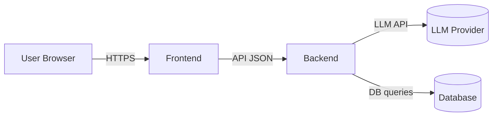
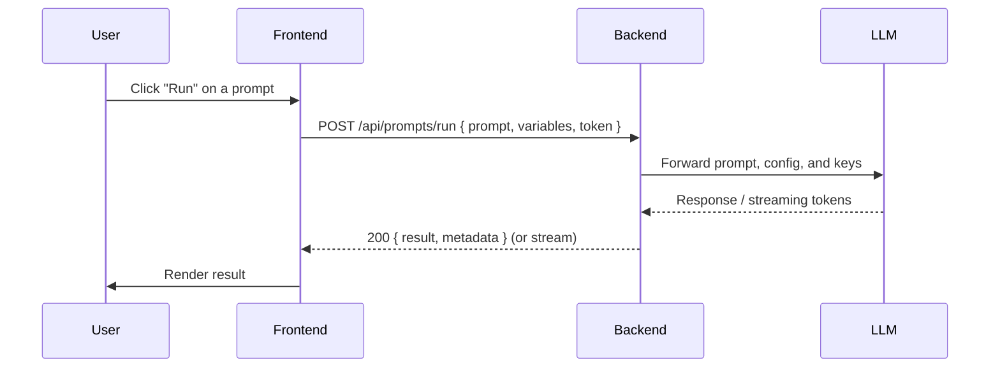

# Prompt_Pilot (Frontend)

A clean, documented README for the Prompt_Pilot frontend repository. This README describes the overall structure, development flow, and how the frontend communicates with its backend: [Backend_promptpilot](https://github.com/abhilashpatra04/Backend_promptpilot.git).

> NOTE: This repository is the frontend for the Prompt_Pilot Android App. The backend lives in the linked repository above and provides the API, authentication, and prompt-processing logic.

---
## Live Demo / Deployed Application

You can access the deployed Prompt_Pilot application here:

📱 **[View Deployed Application](https://drive.google.com/file/d/1YwFJmpNlMEwNgkRAXG75LBW4BhkLndrr/view?usp=drive_link)**

This link contains the live/deployed version of the frontend application integrated with the backend. 
---

## Table of contents

- [Project Overview](#project-overview)
- [High-level architecture](#high-level-architecture)
- [Flow & sequence diagrams](#flow--sequence-diagrams)
- [Folder structure (recommended)](#folder-structure-recommended)
- [Local development setup](#local-development-setup)
- [Environment variables](#environment-variables)
- [API contract (example / suggested endpoints)](#api-contract-example--suggested-endpoints)
- [Deployment notes](#deployment-notes)
- [Testing](#testing)
- [Contributing](#contributing)
- [License](#license)

---

## Project overview

Prompt_Pilot is the frontend Android Application that allows users to create, edit, and run prompts, view results, and manage prompt templates and histories of coversations. The frontend handles UI, client-side validation, state management, and communicates with the backend service which runs the core prompt processing, LLM orchestration, user/tenant management, and persistence.

Backend repository: [Backend_promptpilot](https://github.com/abhilashpatra04/Backend_promptpilot.git)

---

## High-level architecture

- Browser / Client (this repository)
  - UI, local state, routing, authentication token storage (e.g., cookies or localStorage)
- Backend ([Backend_promptpilot](https://github.com/abhilashpatra04/Backend_promptpilot.git))
  - REST (or GraphQL) API
  - Orchestration with external LLMs / services
  - Database / storage
  - Auth & user management
- External Services
  - LLM Providers (OpenAI, Anthropic, etc.)
  - Optional: file-storage, analytics, third-party auth providers

Simple component diagram (text/mermaid):



Sequence diagram describing a typical "generate response" flow:



(If the backend supports streaming, the frontend should subscribe to websockets/SSE or HTTP streaming endpoints and render tokens as they arrive.)

## Local development setup

1. Clone this repository:
   - git clone https://github.com/abhilashpatra04/Prompt_Pilot.git
   - cd Prompt_Pilot

2. Install dependencies:
   - npm install
   - or
   - yarn install

3. Setup and run the backend locally (recommended):
   - Clone the backend:
     - git clone https://github.com/abhilashpatra04/Backend_promptpilot.git
   - Follow the backend README to install dependencies and start the server (commonly `npm start` or `uvicorn` / `flask` etc).
   - By default the backend might run on `http://localhost:5000` or `http://localhost:8000` — check the backend repo README and set the frontend env accordingly.

4. Create a `.env` from `.env.example` and configure:
   - Example variables (see next section)

5. Start the frontend:
   - npm run dev
   - or
   - yarn dev

6. Visit the app in your browser (commonly `http://localhost:3000`).

---

## API contract (example / suggested endpoints)

The exact endpoints must be synchronized with [Backend_promptpilot](https://github.com/abhilashpatra04/Backend_promptpilot.git). Below are suggested/common endpoints the frontend will call:

- POST /api/auth/login
  - Request: { email, password }
  - Response: { accessToken, refreshToken, user }

- POST /api/auth/refresh
  - Request: { refreshToken }

- GET /api/prompts
  - List saved prompts

- POST /api/prompts
  - Create new prompt

- GET /api/prompts/:id
  - Get prompt details

- POST /api/prompts/:id/run
  - Run prompt with given variables
  - Request: { variables, options }
  - Response: { result, tokens, metadata }

- GET /api/history
  - List run history

- Websocket / SSE for streaming responses (optional)
  - /api/stream/prompts/:id/run

Adjust these to match the backend implementation. If you change endpoints, update service/api.ts accordingly.

Curl example:

```bash
curl -X POST "http://localhost:5000/api/prompts/123/run" \
  -H "Authorization: Bearer <token>" \
  -H "Content-Type: application/json" \
  -d '{"variables": {"name": "Ada"}}'
```

---

## Contributing

1. Fork the repo
2. Create a feature branch: git checkout -b feat/your-feature
3. Commit and push
4. Open a pull request describing your changes
5. Ensure tests pass and keep PR focused and small

See the code of conduct and contributing docs (if present).

---

## Useful links

- Backend repository (API & business logic): [Backend_promptpilot](https://github.com/abhilashpatra04/Backend_promptpilot.git)
- This repository: [Prompt_Pilot](https://github.com/abhilashpatra04/Prompt_Pilot)

---

## License


---


