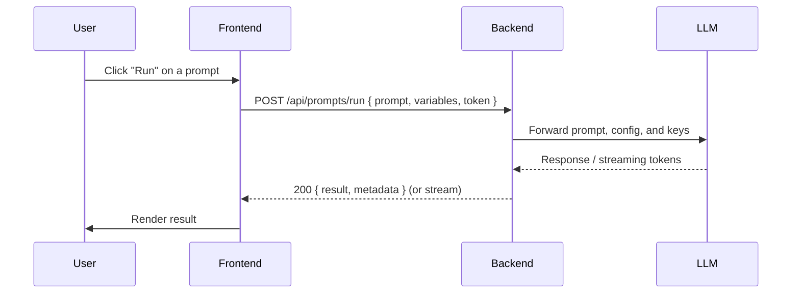

# Prompt_Pilot (Frontend)

A clean, documented README for the Prompt_Pilot frontend repository. This README describes the overall structure, development flow, and how the frontend communicates with its backend: [Backend_promptpilot](https://github.com/abhilashpatra04/Backend_promptpilot.git).

> NOTE: This repository is the frontend for the Prompt_Pilot system. The backend lives in the linked repository above and provides the API, authentication, and prompt-processing logic.

---

## Table of contents

- [Project Overview](#project-overview)
- [High-level architecture](#high-level-architecture)
- [Flow & sequence diagrams](#flow--sequence-diagrams)
- [Folder structure (recommended)](#folder-structure-recommended)
- [Local development setup](#local-development-setup)
- [Environment variables](#environment-variables)
- [API contract (example / suggested endpoints)](#api-contract-example--suggested-endpoints)
- [Deployment notes](#deployment-notes)
- [Testing](#testing)
- [Contributing](#contributing)
- [License](#license)

---

## Project overview

Prompt_Pilot is the frontend application that allows users to create, edit, and run prompts, view results, and manage prompt templates and histories. The frontend handles UI, client-side validation, state management, and communicates with the backend service which runs the core prompt processing, LLM orchestration, user/tenant management, and persistence.

Backend repository: [Backend_promptpilot](https://github.com/abhilashpatra04/Backend_promptpilot.git)

---

## High-level architecture

- Browser / Client (this repository)
  - UI, local state, routing, authentication token storage (e.g., cookies or localStorage)
- Backend ([Backend_promptpilot](https://github.com/abhilashpatra04/Backend_promptpilot.git))
  - REST (or GraphQL) API
  - Orchestration with external LLMs / services
  - Database / storage
  - Auth & user management
- External Services
  - LLM Providers (OpenAI, Anthropic, etc.)
  - Optional: file-storage, analytics, third-party auth providers

Simple component diagram (text/mermaid):

```mermaid
flowchart LR
  A[User / Browser] -->|HTTPS| B(Frontend - Prompt_Pilot)
  B -->|API calls (JSON)| C[Backend - Backend_promptpilot]
  C -->|LLM API / External Services| D[(LLM Provider)]
  C -->|DB queries| E[(Database)]
  note right of C
    Backend repository:\n[Backend_promptpilot](https://github.com/abhilashpatra04/Backend_promptpilot.git)
  end
```

Sequence diagram describing a typical "generate response" flow:



(If the backend supports streaming, the frontend should subscribe to websockets/SSE or HTTP streaming endpoints and render tokens as they arrive.)

---

## Folder structure (recommended)

Below is a recommended structure for the frontend repository. Adjust to your framework (React, Next.js, Vue, Svelte, etc.):

- public/                # static assets
- src/
  - components/          # UI components (Buttons, Inputs, Modals)
  - pages/ or routes/     # route components (PromptEditor, Dashboard)
  - services/
    - api.ts              # thin HTTP client to backend (axios/fetch wrapper)
    - auth.ts             # auth helpers
  - hooks/                # custom hooks (usePrompt, useAuth)
  - context/              # React contexts (AuthContext, ThemeContext)
  - styles/               # css / tailwind config
  - utils/                # helpers (formatting, validators)
  - types/                # TypeScript interfaces
- .env.example            # example environment variables
- package.json
- README.md

---

## Local development setup

1. Clone this repository:
   - git clone https://github.com/abhilashpatra04/Prompt_Pilot.git
   - cd Prompt_Pilot

2. Install dependencies:
   - npm install
   - or
   - yarn install

3. Setup and run the backend locally (recommended):
   - Clone the backend:
     - git clone https://github.com/abhilashpatra04/Backend_promptpilot.git
   - Follow the backend README to install dependencies and start the server (commonly `npm start` or `uvicorn` / `flask` etc).
   - By default the backend might run on `http://localhost:5000` or `http://localhost:8000` — check the backend repo README and set the frontend env accordingly.

4. Create a `.env` from `.env.example` and configure:
   - Example variables (see next section)

5. Start the frontend:
   - npm run dev
   - or
   - yarn dev

6. Visit the app in your browser (commonly `http://localhost:3000`).

---

## Environment variables

Create `.env` (or `.env.local`) in the frontend project root. Example variables:

- REACT_APP_API_BASE_URL=http://localhost:5000/api
- REACT_APP_AUTH_STRATEGY=token
- REACT_APP_OAUTH_CLIENT_ID=your_oauth_client_id  # if used
- NODE_ENV=development

If using Next.js, use NEXT_PUBLIC_BACKEND_URL:

- NEXT_PUBLIC_BACKEND_URL=http://localhost:5000

Important: the backend repository [Backend_promptpilot](https://github.com/abhilashpatra04/Backend_promptpilot.git) contains the server-specific environment variables (API keys, DB connection strings, etc.). Do not expose secrets in the frontend.

---

## API contract (example / suggested endpoints)

The exact endpoints must be synchronized with [Backend_promptpilot](https://github.com/abhilashpatra04/Backend_promptpilot.git). Below are suggested/common endpoints the frontend will call:

- POST /api/auth/login
  - Request: { email, password }
  - Response: { accessToken, refreshToken, user }

- POST /api/auth/refresh
  - Request: { refreshToken }

- GET /api/prompts
  - List saved prompts

- POST /api/prompts
  - Create new prompt

- GET /api/prompts/:id
  - Get prompt details

- POST /api/prompts/:id/run
  - Run prompt with given variables
  - Request: { variables, options }
  - Response: { result, tokens, metadata }

- GET /api/history
  - List run history

- Websocket / SSE for streaming responses (optional)
  - /api/stream/prompts/:id/run

Adjust these to match the backend implementation. If you change endpoints, update service/api.ts accordingly.

Curl example:

```bash
curl -X POST "http://localhost:5000/api/prompts/123/run" \
  -H "Authorization: Bearer <token>" \
  -H "Content-Type: application/json" \
  -d '{"variables": {"name": "Ada"}}'
```

---

## Deployment notes

- Build the frontend (e.g., `npm run build`) and serve with a static hosting provider (Vercel, Netlify) or a simple static server.
- Ensure the frontend's production env variable (e.g., NEXT_PUBLIC_BACKEND_URL) points to the deployed backend API URL (the backend repo should be deployed to a reachable URL).
- Configure CORS on the backend to allow requests from your frontend origin.
- Use secure storage for API keys and secrets on the backend; do not embed them in the frontend.

---

## Testing

- Unit tests: run `npm test` (or framework-specific command)
- E2E tests: configure Playwright / Cypress to point at a test backend or a staging environment.
- Linting: run `npm run lint` to ensure code style.

---

## Troubleshooting

- 401 Unauthorized: confirm the token is correctly stored and sent (Authorization header).
- CORS errors: ensure backend CORS settings include frontend origin.
- Backend not found: confirm backend is running and REACT_APP_API_BASE_URL / NEXT_PUBLIC_BACKEND_URL points to the right host/port.
- Streaming not working: confirm backend supports streaming and that you use SSE/Websocket correctly.

---

## Contributing

1. Fork the repo
2. Create a feature branch: git checkout -b feat/your-feature
3. Commit and push
4. Open a pull request describing your changes
5. Ensure tests pass and keep PR focused and small

See the code of conduct and contributing docs (if present).

---

## What's next / Integration checklist

- [ ] Ensure backend endpoints match the frontend expectations.
- [ ] Add sample prompts and fixtures for development.
- [ ] Add streaming UI for token-by-token rendering (if backend supports streaming).
- [ ] Set up CI for automated tests and linting.
- [ ] Deploy backend and frontend to staging for integration tests.

---

## Useful links

- Backend repository (API & business logic): [Backend_promptpilot](https://github.com/abhilashpatra04/Backend_promptpilot.git)
- This repository: [Prompt_Pilot](https://github.com/abhilashpatra04/Prompt_Pilot)

---

## License

Specify your license here (e.g., MIT). If you haven't chosen one yet, consider adding a LICENSE file.

---

If you'd like, I can:
- generate a starter `src/services/api.ts` configured for the backend URL,
- produce a `.env.example` filled with recommended variable names,
- or create a diagram image (SVG) and add it to the repo.

Tell me which next step you prefer.
